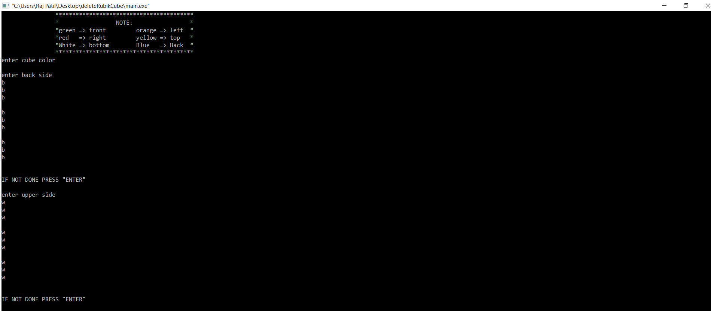
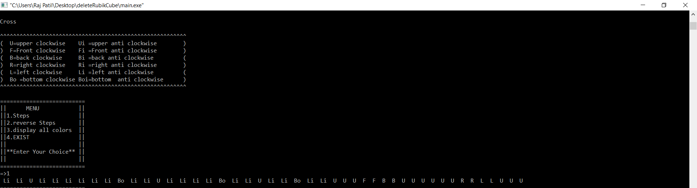
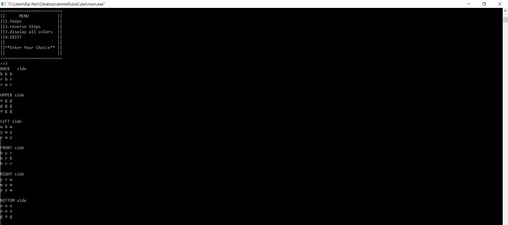

# Rubik Cube Solution
NOTE-THIS CODE IS ONLY WORK IN CODE BLOCKS.

# NOTE
chose only first letter of colour example: orange=>o

# DESCRIPTION OF NOTATION WHICH WILL USE FOR SOLVING RUBIK CUBE

U=upper clockwise    

Ui =upper anti clockwise

F=Front clockwise

Fi =Front anti clockwise

B=back clockwise

Bi =back anti clockwise

R=right clockwise

Ri =right anti clockwise

L=left clockwise

Li =left anti clockwise

Bo =bottom clockwise 

Boi=bottom  anti clockwise

# STEPS
there is 5 Steps 
1.Make Cross
2.First Layer
3.Middle Layer 
4.Upper Layer
5.Full Rubik Cube

in all steps there is Choice of Selection except Full Rubik Cube Step
IN Full Rubik Cube Step

        1.FOR GETTING FISH SHAPE TAKE CORNER COLOUR AT LEFT BOTTOM
R U Ri U R U2 Ri
if not done enter (0)0
make right is your front
R U Ri U R U2 Ri
if done enter (0)1
restart

        2.FOR DIGONAL COLOUR
R U Ri U R U2 Ri
if done enter (0)1
restart
FOR SOLVING HEDLIGHTS OF LAST LAYER
       
       1.ALGORITHUM
Ri F Ri B B R Fi Ri B B R R
if done enter (0)1
restart

        2.ALGORITHUM
R Ui R U R U R Ui Ri Ui R R
if done enter (0)1
restart

# Choice of Selection 
1.Steps=it will give steps in sequence for solving Rubik cube.(this is will display only ones)
 
2.Reverse Steps=it will give steps in reverse order for anti solving Rubik cube.(this is will display only ones)

3.Display all colors=it will conform the order of colour which should match with user Rubik Cube.

4.Exist=it will stop the step

# OUTPUT
This is input Screen Shots 

After Filling all Parameter we have this option

this is Screen shot of all colours

